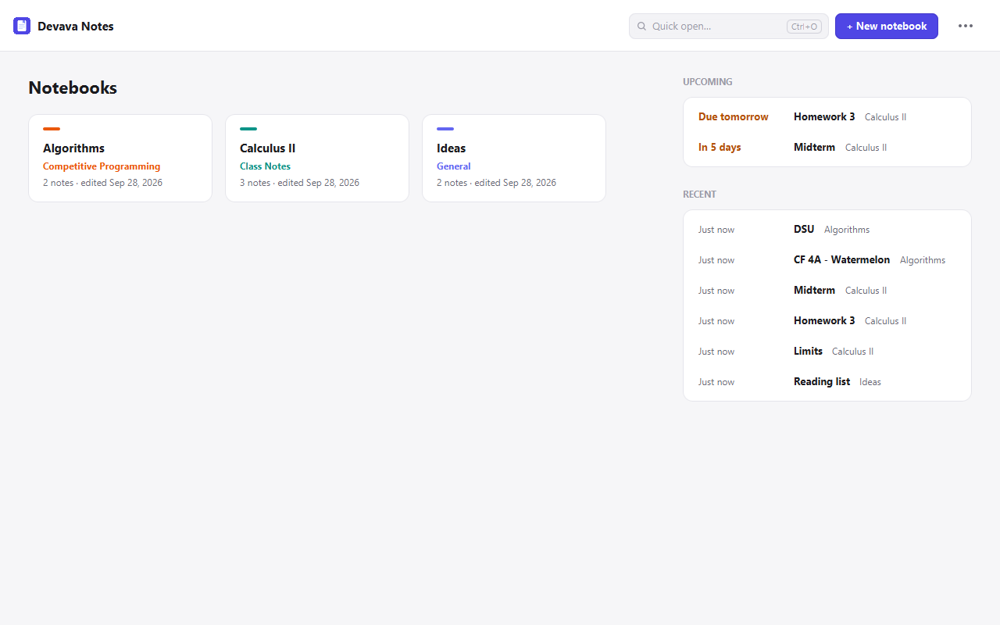
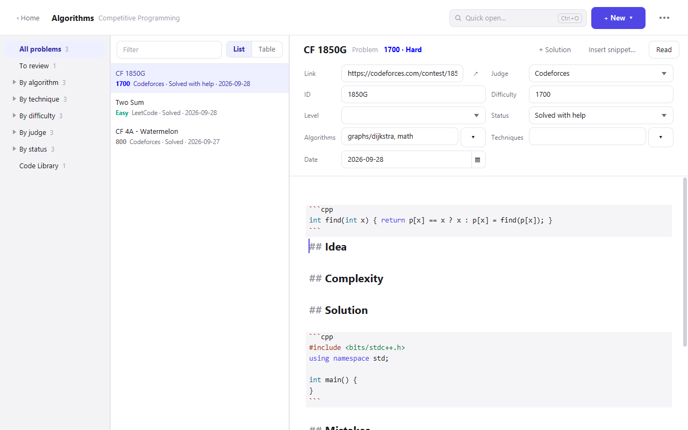
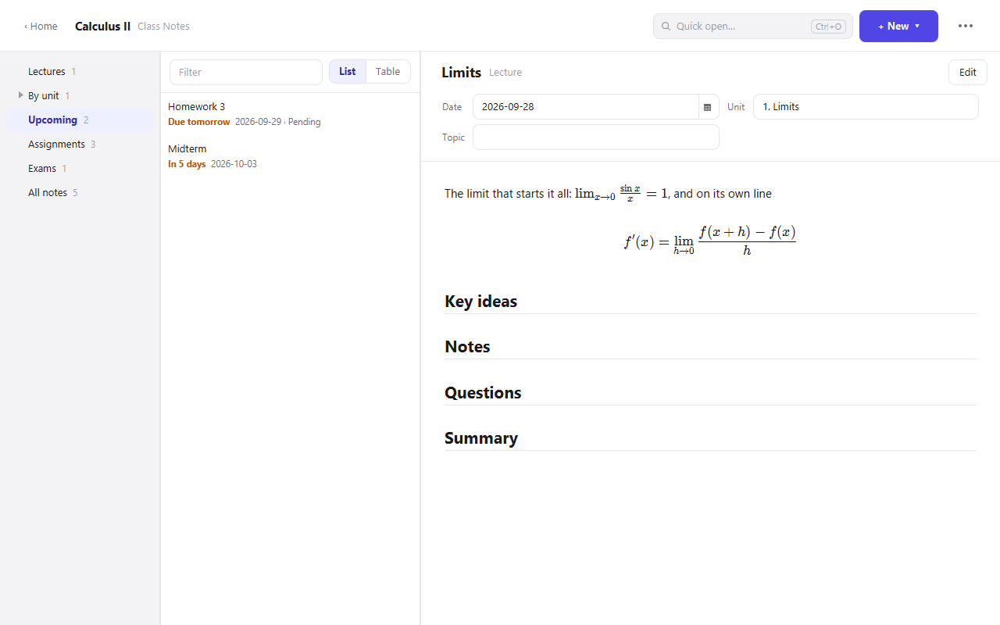
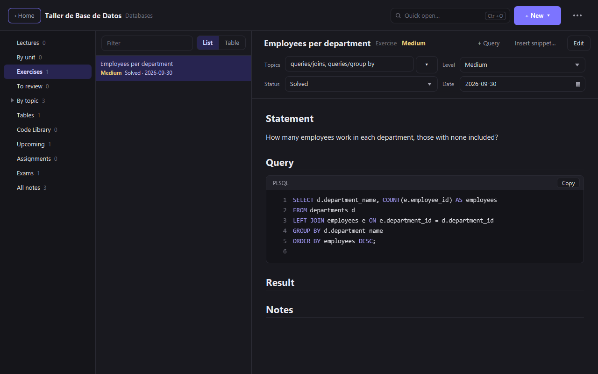

# Devava Notes

[](https://github.com/HideOnVava/devava-notes/releases/latest)
[](https://github.com/HideOnVava/devava-notes/actions/workflows/ci.yml)
[](#download)
[](LICENSE)

A desktop notes app whose notebooks know what they hold, built by **devava XP Studios**.

A notebook of **class notes** knows about lectures, assignments and exams, and tells you what
is due next. A notebook of **competitive programming** knows about Codeforces, AtCoder and
LeetCode problems, sorts them by algorithm, technique and difficulty, and keeps your C++
ready to reuse. A **databases** notebook is a database course with Oracle: SQL and PL/SQL
exercises by topic, the tables you query and the queries you reuse. A **general** notebook is
just notes with tags. Every note is a plain Markdown file on your disk: no accounts, no
cloud, no Java to install. The app speaks **English and Spanish** (*Español*): it follows
Windows' language, and *⋯ → Language* switches it.

| Home | Competitive Programming |
| --- | --- |
|  |  |

| Class Notes, reading view | Databases, dark theme |
| --- | --- |
|  |  |

## Download

**[⬇ Download the latest version](https://github.com/HideOnVava/devava-notes/releases/latest)**
for 64-bit Windows 10 or 11. On that page, under **Assets**:

| File | Then |
| --- | --- |
| `…-windows-x64-setup.exe` | **Recommended.** Open it. If Windows shows *"Windows protected your PC"*, click **More info → Run anyway** ([why](#why-does-windows-show-a-warning)). Keep the suggested folder and finish: Devava Notes appears in the Start menu and, unless you untick the box, on the desktop. No administrator rights needed. |
| `…-windows-x64-portable.zip` | No installation: unzip anywhere (a USB stick works) and open `Devava Notes.exe`. |

macOS and Linux versions are planned.

### First steps

1. **Create a notebook** with *+ New notebook* and pick its type: *General*, *Class Notes*
   (one per course), *Competitive Programming* or *Databases*.
2. **Write a note** with *+ New* (`Ctrl+N`). In a Competitive Programming notebook, paste
   the problem's link: the judge, the problem's ID and a solution block with your C++
   template are filled in.
3. **Fill in its properties** above the text (the due date of an assignment, the algorithms
   of a problem…) and the notebook's views on the left sort it for you.

### Updating and uninstalling

Install a new version the same way: the installer replaces the previous one. To uninstall:
*Settings → Apps → Installed apps → Devava Notes → Uninstall* (the portable version: delete
its folder). Either way your notes stay in your Documents folder.

### Why does Windows show a warning?

The downloads are not code-signed: a signing certificate costs money every year, and this is
a free project. Windows therefore shows *"Windows protected your PC"* the first time; *More
info → Run anyway* opens it, and Windows remembers your choice. Every release is built by
GitHub Actions from the tagged source code, so the build log shows exactly what went into the
files, and each release lists their SHA-256 checksums.

## Notebook types

Each type brings its own properties (shown above the note), templates for new notes and views
(on the left). Every view shows its notes as a list or as a table with sortable columns.

- **General**: *Tags* and *Pinned*. Views: all notes, pinned, by tag.
- **Class Notes**: *lectures* (date, unit, topic), *assignments* (due date, status) and
  *exams* (date, topics, grade). Views: lectures, by unit, **Upcoming** (what is still to do,
  soonest first, late work in red), assignments, exams, all notes. Right-click an assignment
  to mark it as done. Home lists what is coming up in all your courses.
- **Competitive Programming**: *problems* (link, judge, ID, difficulty, status, algorithms,
  techniques, date) and *snippets* for the **Code Library**. Views: all problems, **To
  review** (solved with help), by algorithm (subtopics such as `graphs/dijkstra` nest under
  `graphs`), by technique, by difficulty, by judge, by status, and the Code Library.
  Difficulty is kept as the judge gives it (a Codeforces rating, AtCoder points, LeetCode's
  Easy / Medium / Hard) and also on one scale for all three judges, shown in the judge's
  colors. *+ Solution* adds another solution block; *Insert snippet…* copies code from the
  library into the note; each notebook has its own C++ template (notebook menu → *C++
  template…*).
- **Databases**: a database course, written for Oracle's SQL and PL/SQL. *Lectures* (date,
  unit, topics), *exercises* (topics, level, status, date), *tables* of the schema you work
  with, *snippets* for the **Code Library**, and *assignments* and *exams* as in Class Notes.
  Views: lectures, by unit, exercises, **To review**, **by topic** (`plsql/cursors` nests
  under `plsql`; the topics offered go from `queries/joins` to `plsql/triggers`), tables, the
  Code Library, **Upcoming**, assignments, exams and all notes. Its templates write code in
  ` ```plsql ` blocks, colored with Oracle's words (`VARCHAR2`, `SYSDATE`, SQL*Plus
  commands); *+ Query* adds one at the cursor and *Insert snippet…* copies one from the
  library.

## Writing

Notes are Markdown. The editor draws headings, emphasis and code as you type; the reading
view (`Ctrl+E`) shows the finished note.

- **Math**: `$e^{i\pi} + 1 = 0$` inline, or a block between `$$` lines, drawn by KaTeX.
- **Code**: fenced blocks (```` ```cpp ````) are colored by language; the reading view numbers
  their lines and adds a *Copy* button.
- **Links**: `[[Another note]]` (or `[[Another note|shown text]]`); typing `[[` suggests the
  titles. `Ctrl+click` follows a link in the editor, a click in the reading view. A link to a
  note that does not exist yet is orange in the reading view, and following it creates the
  note.
- **Tags**: `#tag` anywhere in the text (`#topic/subtopic` works too); a click on a tag shows
  every note that has it.
- **Pictures**: paste one with `Ctrl+V` or drop the file on the note. It is saved in the
  notebook's `attachments` folder and linked where the cursor is.
- Tables, task lists (`- [ ]`) and strikethrough, as on GitHub.

## Keyboard shortcuts

| Key | Action |
| --- | --- |
| `Ctrl+N` | New notebook (on Home) or new note (in a notebook) |
| `Ctrl+O` | Quick open: any note by its title |
| `Ctrl+Shift+F` | Search the text of every note (accents and case do not matter) |
| `Ctrl+E` | Read or edit the open note |
| `Ctrl+F` | Find (and replace) in the open note |
| `Ctrl+V` | Paste a picture, when the clipboard holds one |
| `[[` | Link to a note, with the titles suggested |
| `Ctrl+click` | Follow the `[[link]]` under the mouse, in the editor |
| `Ctrl+Z` / `Ctrl+Y` | Undo / redo |

## Where your notes live

Everything is in a `Devava Notes` folder inside your Documents folder (OneDrive redirection
is honored). Each notebook is a folder, and each note a `.md` file named after its title:

```
Documents\Devava Notes\
├── settings.json                 the theme
└── Algorithms\
    ├── .notebook.json            the notebook's type and its C++ template
    ├── attachments\              pictures pasted or dropped on its notes
    └── CF 4A - Watermelon.md
```

A note's properties are its YAML front matter, so the files open anywhere Markdown does
(Obsidian included), and notes written elsewhere show up in the app. Their values stay in
English (`status: Solved`) whichever language the app speaks, so a notebook shared between
English and Spanish users works the same for both:

```markdown
---
url: https://codeforces.com/problemset/problem/4/A
judge: Codeforces
id: 4A
difficulty: 800
algorithms: [math, brute force]
status: Solved
---
## Idea
Two even parts only if w is even and greater than 2.
```

- Every change is saved a moment after you make it; files are written atomically, so a
  crash never leaves half a note.
- Deleting a note or a notebook moves it to the Recycle Bin.
- Folders you create by hand become General notebooks.
- **To share a notebook** (your class notes with your classmates, say): its menu → *Export as
  ZIP…*. Whoever gets the ZIP adds it with *Import notebook…* in Home's menu; it opens as it
  was, type, pictures and all, next to their own notebooks.
- To keep the notes somewhere else, start the app with `-Dnotes.home=<folder>` (from source)
  or set the environment variable `JAVA_TOOL_OPTIONS=-Dnotes.home=<folder>` (installed app).

---

## For developers

Java 21, JavaFX 21 (with WebView), Maven (wrapper included), Gson and commonmark-java. The
editor is CodeMirror 6, with KaTeX for math, bundled by esbuild into one script that the
WebView loads. Tests use JUnit 5; the compiler runs with `-Xlint:all` and the build is
expected to stay warning-free.

```bash
./mvnw javafx:run                  # run from source (JDK 21 required)
./mvnw test                        # unit tests
./mvnw verify -Dsmoke=true         # also opens the real window and saves screenshots in target/smoke
```

The editor's source is [`editor/main.js`](editor/main.js). After changing it, rebuild the
bundle (Node.js 20 or later) and commit the result, `src/main/resources/com/devavaxp/notes/editor.js`:

```bash
cd editor
npm install
npm run build
```

The app icon is drawn by [`tools/icon/Icon.java`](tools/icon/Icon.java): `java tools/icon/Icon.java`
writes `packaging/icon.png`, `packaging/icon.ico` and the window icon.

### Building the application

`packaging/build-windows.ps1` compiles with the Maven wrapper, copies the dependencies, builds
a trimmed Java runtime with `jlink` (the JDK modules in `packaging/jdk-modules.txt` plus
JavaFX) and calls `jpackage` with that runtime and the application jars on the class path. It
needs a full JDK 21 (with its `jmods` folder), found through `JAVA_HOME` or `-JdkHome`:

```powershell
powershell -ExecutionPolicy Bypass -File .\packaging\build-windows.ps1
```

The result is `dist\Devava Notes\Devava Notes.exe`. `-Destination "$env:LOCALAPPDATA\Programs" -Shortcut`
installs it for yourself with a desktop shortcut, and `-Type exe` builds the installer, which
needs the [WiX Toolset 3.x](https://github.com/wixtoolset/wix3/releases).

### Releasing a new version

Releases are built, smoke-tested and published by GitHub Actions
([`.github/workflows/release.yml`](.github/workflows/release.yml)), so every download comes
from a clean build of a tagged commit. To publish, for example, version 1.1.0:

1. Set `<version>1.1.0</version>` in `pom.xml`.
2. Add a `## [1.1.0] - <date>` section to [`CHANGELOG.md`](CHANGELOG.md) (it becomes the
   release's "What's new") and its link at the bottom of the file.
3. Commit and push, then push the tag:

   ```bash
   git tag v1.1.0
   git push origin v1.1.0
   ```

Running the workflow by hand from the *Actions* tab is a dry run: it builds and tests
everything and keeps the files as workflow artifacts, without publishing a release.

## License

[MIT](LICENSE) © 2026 devava XP Studios. The app bundles CodeMirror and KaTeX (MIT),
commonmark-java (BSD-2-Clause), Gson (Apache-2.0) and a Java runtime with JavaFX (GPL-2.0
with the Classpath Exception); see [THIRD-PARTY-NOTICES.md](THIRD-PARTY-NOTICES.md).
